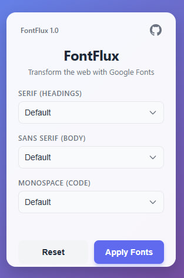
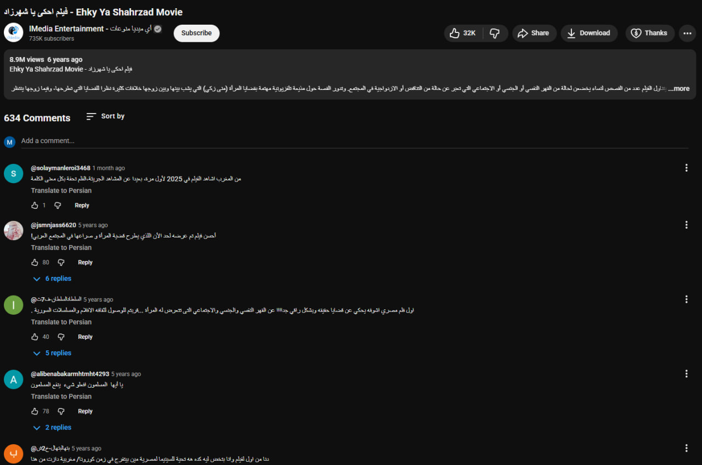
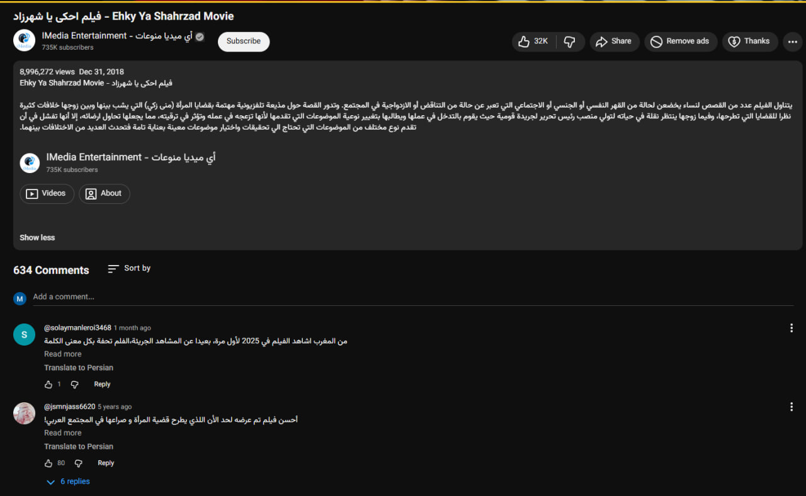
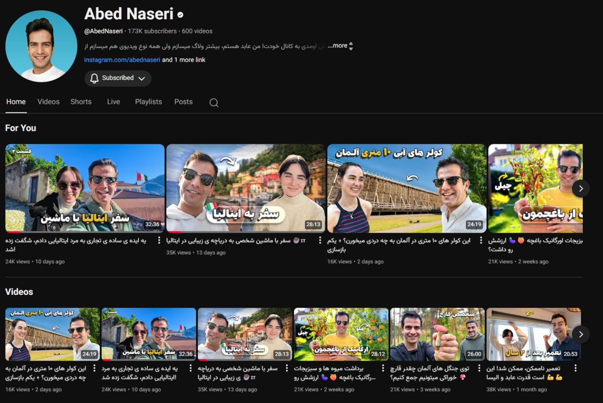
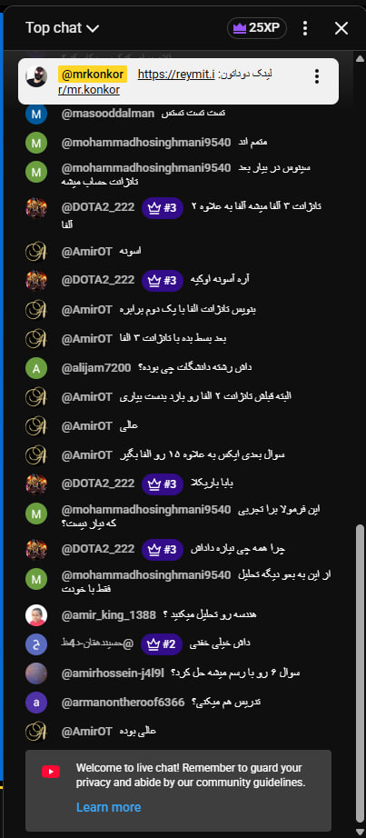
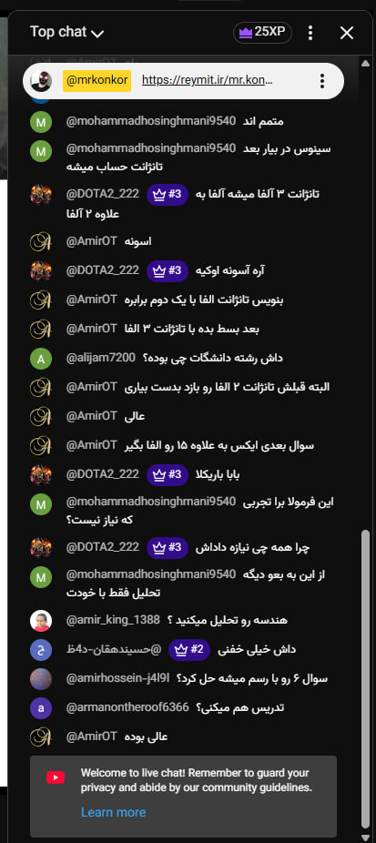

  
  <h1>فونت‌فلاکس (FontFlux)</h1>

فونت‌فلاکس یک افزونه قدرتمند کروم است که به شما قدرت می‌دهد تا با شخصی‌سازی فونت‌ها در هر وب‌سایتی با استفاده از کتابخانه عظیم گوگل فونت (Google Fonts)، کنترل تجربه خواندن خود را در دست بگیرید. چه یک فونت سریف خاص را برای خواندن مقالات ترجیح دهید و چه یک فونت بدون سریف (sans-serif) تمیز را برای وب‌گردی، فونت‌فلاکس شخصی‌سازی وب را آسان می‌کند.

  

> **نکته:** ما در حال کار بر روی انتشار فونت‌فلاکس در فروشگاه وب کروم (Chrome Web Store) به زودی هستیم!

## چرا فونت‌فلاکس را انتخاب کنید؟

* **انتخاب فونت برتر**: فونت‌فلاکس دارای مجموعه‌ای بسیار بزرگتر از فونت‌ها نسبت به سایر افزونه‌های مشابه است.
* **پشتیبانی از چت زنده یوتیوب**: برخلاف سایر افزونه‌های مشابه، فونت‌فلاکس می‌تواند فونت **چت‌باکس زنده یوتیوب و سایر چت‌باکس‌ها** را نیز تغییر دهد.
* **قابل شخصی‌سازی**: شما می‌توانید فونت را برای هر دسته (سریف، بدون سریف و مونواسپیس) مطابق سلیقه خود تنظیم کنید.
* **سبک**: فونت‌فلاکس سبک است و بر عملکرد مرورگر شما تأثیر نمی‌گذارد.

## نمونه‌ها

ببینید فونت‌فلاکس چگونه تجربه وب‌گردی شما را تغییر می‌دهد:

| قبل | بعد |
| :---: | :---: |
|  |  |
|  |  |
|  |  |

فونت انتخاب شده در تصاویر بالا **Vazirmatn** است.

## نحوه عملکرد

فونت‌فلاکس با تزریق یک اسکریپت محتوا (content script) به صفحات وبی که بازدید می‌کنید عمل می‌کند. وقتی فونت‌های مورد نظر خود را از طریق پاپ‌آپ افزونه انتخاب می‌کنید:

1. افزونه تنظیمات شما را در حافظه محلی مرورگر ذخیره می‌کند.
2. به صورت پویا استایل‌شیت‌های فونت انتخاب شده را از API گوگل فونت بارگذاری می‌کند.
3. این فونت‌ها را با بازنویسی ویژگی‌های پیش‌فرض `font-family` CSS برای عناصر سریف، بدون سریف و مونواسپیس به صفحه اعمال می‌کند.
4. تنظیمات شما پایدار می‌مانند، بنابراین فونت‌های مورد علاقه شما به طور خودکار در هر صفحه جدیدی که باز می‌کنید اعمال می‌شوند.

## نحوه استفاده

### نصب

از آنجا که این پروژه در حال حاضر در مرحله توسعه/متن‌باز است:

1. این مخزن را کلون کنید یا دانلود نمایید.
2. کروم را باز کنید و به آدرس `chrome://extensions/` بروید.
3. گزینه **"Developer mode"** را در گوشه بالا سمت راست فعال کنید.
4. روی دکمه **"Load unpacked"** کلیک کنید.
5. پوشه‌ای که فایل‌های فونت‌فلاکس را در آن ذخیره کرده‌اید انتخاب کنید.

### شخصی‌سازی فونت‌ها

1. روی **آیکون فونت‌فلاکس** در نوار ابزار کروم کلیک کنید.
2. منوهای کشویی برای انواع فونت **Serif**، **Sans Serif** و **Monospace** را مشاهده خواهید کرد.
3. فونت دلخواه خود را برای هر دسته از لیست انتخاب کنید.
4. تغییرات بلافاصله روی صفحه فعلی اعمال می‌شوند.
5. از تجربه وب شخصی‌سازی شده لذت ببرید!

## سلب مسئولیت

این افزونه "همانطور که هست" و بدون هیچ گونه ضمانتی ارائه می‌شود. در حالی که ما تلاش می‌کنیم از سازگاری با اکثر وب‌سایت‌ها اطمینان حاصل کنیم، تغییر اجباری فونت‌ها گاهی اوقات می‌تواند بر چیدمان بصری یا طراحی برخی صفحات تأثیر بگذارد. با صلاحدید خود از آن استفاده کنید. ما وابسته به گوگل یا گوگل فونت نیستیم.

## متن‌باز

این یک پروژه متن‌باز است و ما از مشارکت‌های جامعه استقبال می‌کنیم! اگر ایده‌ای برای ویژگی‌های جدید، رفع اشکال یا بهبود دارید، لطفاً مخزن را فورک کنید و یک **Pull Request** ارسال نمایید.

بازخورد و مشارکت‌های شما به بهتر شدن فونت‌فلاکس برای همه کمک می‌کند.
